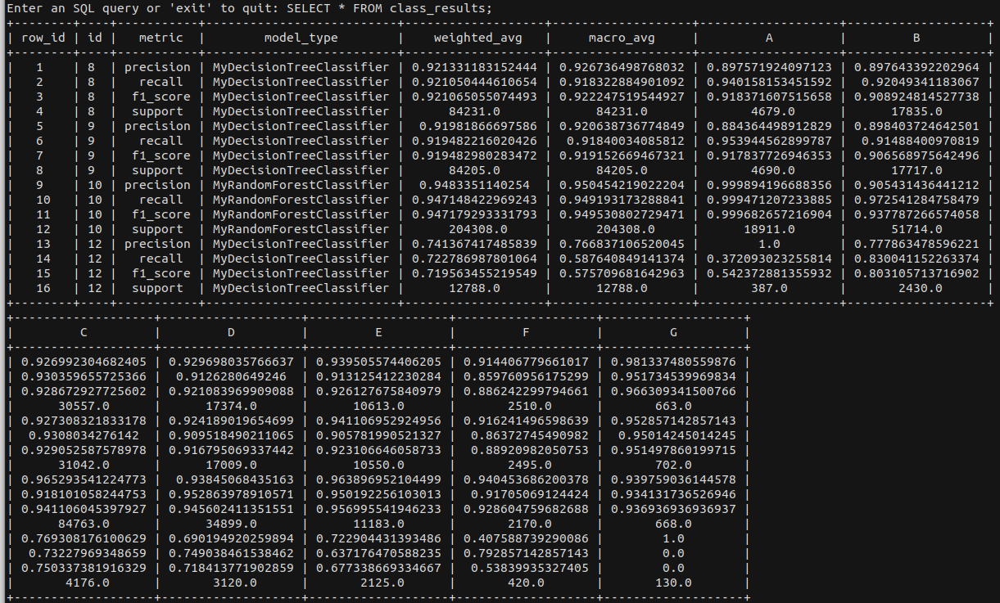
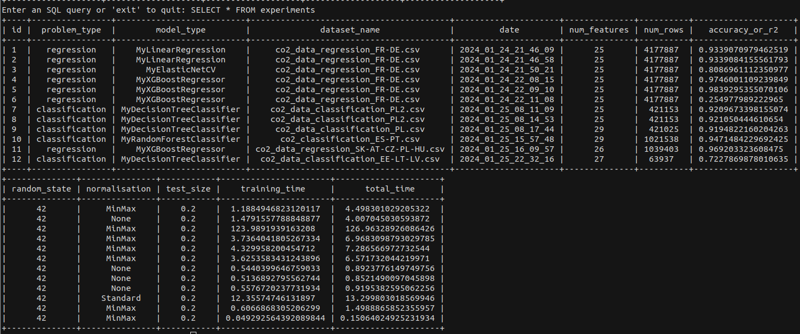

# **Car CO2 Emissions**

In this project, we aim to build a model capable of predicting automobile CO2 emissions or their CO2 score.
Our dataset has been fetched from the European Environment Agency (EEA).  
It contains information about all car registrations recorded in 2021 in the EU + non EU cooperating countries.  

This repository contains:
- /report: Our project report in text format.
- /streamlit: Our project presentation for the thesis defense.
- /app: Our CLI experimentation app files. This app helps the user fetch the data archive, preprocess country specific datasets, run and save classification / regression models, and record / view experiment data into sqlite tables.
- /notebooks: The jupyter notebooks containing data visualisation, preprocessing steps, classification / regression models and interpretability diagnostics.
- /src/auto_co2: A custom python package containing all the tools we created for fetching the dataset, preprocessing, plotting and displaying tables.
- /data: A sample of the data is available, the dataset will be downloaded and modified in down this folder.
- /database: Contains the database *file experiments.db*. SQL queries can be displayed within the app if needed.
- *setup.py*: File that enables the pip install for the custom package *auto_co2*. Command: **`pip install .`**
- *launcher.py*: The app's launcher file, to execute through command line.
- *Dockerfile*: The app's image builder, allows to run the app in a container without needing any condfiguration.
- *environment.yml*: A simplified version of essential python requirements for conda / anaconda.
- *requirements.txt*: The full list of libraries installed on the python env used for development.

## **1.The App: setup**

The app container is a ready-tu-use development/experimentation environment.  
It contains every python package needed to use our app and our auto_co2 library.  
It also allows to fetch the dataset easily from github.com (git lfs).
It relies on a docker-compose file that **mounts the whole repository as a volume**.  
**This means any file created or modified in the repository during image run will persist after the container has been killed**.
The docker image itself contains a functional, yet barebone version of the repository,  
the following files need to be generated using the app:
- Datasets raw and processed
- Machine learning / deep learning trained models
- Interpretability models

### **A. Run in a docker container**

#### **Windows / Mac with Docker Desktop**

- Open Docker Desktop: Start Docker Desktop from the start menu or the system tray.
- Open the Docker Dashboard: Click on the Docker icon in the system tray and select 'Dashboard' from the context menu.
- Navigate to the Images section: In the Docker Dashboard, click on the 'Images' tab on the left side.
- Build the Docker image: 
    - Click on the 'Build...' button at the top right of the Docker Dashboard. A dialog box will open. 
    - In the 'Build context' field, browse to the directory of your Dockerfile (the cloned repository). 
    - In the 'Dockerfile' field, select the Dockerfile. 
    - In the 'Tag' field, enter the name you want to give to your Docker image. 
    - Click on the 'Build' button to start building the image.

- Locate the repository folder path and the 'docker-compose.yml' in its root
- Open a powershell / terminal session and change working directory to the repository root
- Type `docker-compose run repo` to run the image with the whole repository mounted as a volume
- The app starts in a container in interactive mode
- Exit the app and type `docker-compose down`

This file defines the container configuration and dependencies for your application.

#### **Linux / bash terminal**

**Build the image: the easy way...**
- Have Docker Engine running
- Start the app with `python launcher.py`
- Press [1] and [Enter]

**Build the image: standard procedure**
- Open a terimnal session in the repository root
- Build the image with `docker build -t auto_co2 .`

**Start the image with docker-compose**
- Open a terminal session in the repository root
- Type `docker-compose run repo`
- The app starts in a container in interactive mode
- Exit the app and type `docker-compose down`

### **B. Run the app with a dedicated conda environment**

- Open a terminal session in the repository root
- Type `conda env create -f  environment.yml`
- You'll also need to install sqlite3 to process database actions
- Activate your conda "co2" environment: `conda activate co2`
- run `python launcher.py` 

## **2. The App: guide**

Here's the main menu:

- Press [2] + [ENTER] to download the dataset from the github's repo page

- Press [3] + [ENTER]  to run preprocessing. You'll be prompted for options: select countries, etc.  

  

  

- Press [4] + [ENTER]  to run classification or press [5] + [ENTER]  to run regression. You'll be prompted for hyperparameter selection, etc.

- Once the model has been trained, it is evaluated on the test set:  

- You are given the choice to save the model and write the results in the database (/database/experiments.db)

- Press [8] + [ENTER]  to run SQL queries and explore the experimentation results:  

  

Tables:
        - **experiments**: General info about experimentations, 1 row per experiment
        - **model_hyperparameters**: Maps every model available with its modifiable parameters
        - **xp_hyperparameters**: Hyperparameter values, 1 row per experiment
        - **reg_results**: Evaluates the metrics specific to regression, 1 row per experiment
        - **class_results**: Evaluates the metrics specific to multiclass classification (co2 Score), 4 rows per experiment

  

- Exit app and container with [9] + [Enter] or [ctrl] + [c]

## **Guide to the auto_co2 python package**

This package consists in 4 submodules:
- **Data**: A set of tools created to load, preprocess and save content from the dataset
- **Agg**: Aggregators to analyze data, draw tables and plot figures on country level, manufacturer level, and car model level
- **styles**: Tools to take advantage of pandas stylers and pretty print pandas objects
- **viz**: Globally all plotting that we used but translated into Plotly Express / Plotly Graph Objects for esthetics and interactivity

### **A. Agg**

Some functionalities:

Instance of the country aggregator object

Instance of the manufacturer aggregator object, and sorted display:  

Manufacturer aggregator's plot_popular_pool_brands:  

Instance of the car aggregator object

Car aggregator's spec method:  

Car aggregator's polar chart method:

Car aggregator's facetplot method (bubble = car model, bubble size = count, color = car brand, facetplot = car pool (consolidated group))

### **B. Viz**

#### **Preprocessing**

  

  

#### **Machine Learning**

  

  

  

  

### **Styles**

#### **Machine Learning**

  

  

  

